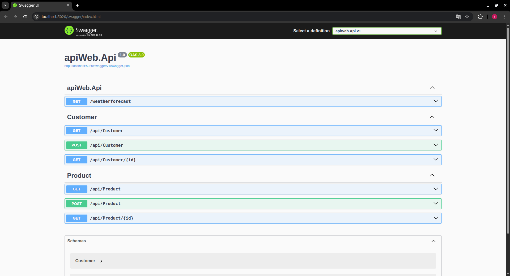

# DDD con C# - Guía

## Crear la solución y los proyectos

Crea una carpeta, desde la que vamos a trabajar.

Para trabjar con DDD, necesitaremos Domain, Application, Infrastructure y API.

### Crear los proyectos
Nuestro proyecto se llamará `webApi`.
```bash
dotnet new classlib -n webApi.Domain
dotnet new classlib -n webApi.Application
dotnet new classlib -n webApi.Infrastructure

dotnet new webapi -n webApi.Api
```

Ahora mismo nuestro proyecto deberia lucir algo asi:

```
webApi
|-- webApi.Api
|-- webApi.Application
|-- webApi.Domain
|-- webApi.Infrastructure
```

### Agregar los proyectos a la solución

En la carpeta raíz (`webApi`) si **NO** existe, crear el archivo `.sln` de la solución.

```
dotnet new sln
```

**Agregar los proyectos a la solución**

```bash
dotnet sln . add webApi.Api
dotnet sln . add webApi.Application
dotnet sln . add webApi.Domain
dotnet sln . add webApi.Infrastructure
```

### Agregar referencias entre proyectos

Esto es para poder usar los recursos de un proyecto en otro.
Mas información sobre referencias en: [Referencias.md](Referencias.md)

```bash
dotnet add apiWeb.Application reference apiWeb.Domain
dotnet add apiWeb.Infrastructure reference apiWeb.Domain
dotnet add apiWeb.Api reference apiWeb.Application
dotnet add apiWeb.Api reference apiWeb.Infrastructure  # opcional para DI
```

¿Por qué de `apiWeb.Api` -> `apiWeb.Infrastructure` es opcional?
Porque estamos vamos a trabajar con interfaces que vamos a inyectar en el program de `apiWeb.Api`, si no vas a trabjar con interfaces, no es necesario hacer la ultima relación.

## Crear una entidad en `Domain`

Para hacerlo simple, haremos una entidad `Customer` con `Id`, `Name`, `Email` y `Age`.

_¿Por qué en `Entities` y no en `Models`?_

- **Entities** es la carpeta que normalmente usamos para las clases que representan las **entidades del dominio**, es decir, objetos con identidad propia y reglas de negocio.
- **Models** suele usarse más en proyectos web o API para representar datos de entrada o salida (DTOs), o en aplicaciones más tradicionales, pero no es tan específico para DDD.

Asi se distingue claramente la lógica central del dominio (entidades, agregados, valores) de otras capas, como Application o Infrastructure.

---

**apiWeb.Domain/Entities/Customer.cs**

```csharp
namespace apiWeb.Domain.Entities;

public class Customer
{
    public int Id { get; set; }
    public string Name { get; set; }
    public string Email { get; set; }
    public int Age { get; set; }
}
```

## Crear un repositorio para el repositorio de Customer

**apiWeb.Domain/Repositories/ICustomerRepositorie.cs**

```csharp
using apiWeb.Domain.Entities;

namespace apiWeb.Domain.Repositories;

public interface ICustomerRepository
{
    Task<Customer?> GetByIdAsync(int id);
    Task<IEnumerable<Customer>> GetAllAsync();
    Task AddAsync(Customer customer);
    Task UpdateAsync(Customer customer);
    Task DeleteAsync(int id);
}
```

## Crear el repositorio de Customer

**apiWeb.Infrastructure/Repositories/CustomerRepository.cs**

No le voy a añadir la lógica aún.

```csharp
using apiWeb.Domain.Entities;
using apiWeb.Domain.Repositories;

namespace apiWeb.Infrastructure.Repositories;

public class CustomerRepository : ICustomerRepository
{
    private readonly List<Customer> _customers = new List<Customer>();
    public Task<Customer?> GetByIdAsync(int id)
    {
        throw new NotImplementedException();
    }

    public Task<IEnumerable<Customer>> GetAllAsync()
    {
        throw new NotImplementedException();
    }

    public Task AddAsync(Customer customer)
    {
        throw new NotImplementedException();
    }

    public Task UpdateAsync(Customer customer)
    {
        throw new NotImplementedException();
    }

    public Task DeleteAsync(int id)
    {
        throw new NotImplementedException();
    }
}
```

## Crear el servicio

**apiWeb.Application/Services/CustomerService.cs**

```csharp
using apiWeb.Domain.Entities;
using apiWeb.Domain.Repositories;

namespace apiWeb.Application.Services;

public class CustomerService
{
    private readonly ICustomerRepository _customerRepository;
    
    // Inyección
    public CustomerService(ICustomerRepository customerRepository)
    {
        _customerRepository = customerRepository;
    }

    public Task<IEnumerable<Customer>> GetAllCustomerAsync()
    {
        return _customerRepository.GetAllAsync();
    }
    
    public Task<Customer?> GetProductByIdAsync(int id)
    {
        return _customerRepository.GetByIdAsync(id);
    }

    public Task AddCustomerAsync(Customer customer)
    {
        return _customerRepository.AddAsync(customer);
    }

    public Task UpdateCustomerAsync(Customer customer)
    {
        return _customerRepository.UpdateAsync(customer);
    }

    public Task DeleteCustomerAsync(int id)
    {
        return _customerRepository.DeleteAsync(id);
    }
}
```

## API

En `apiWeb.Api` tendremos que inyectar de application y crear los controladores para hacer la API.

### Inyectar servicios

**apiWeb.Api/Program.cs**

Antes de `builder.Build()` vamos a añadir:

```csharp
// Configurar Dependencias

// Inyectar repositorio (opcional) - No usaremos su lógica, solo sus interfaces
// El repositorio es opcional ya que este se inyecta en webApi.Application
// Pero estamos usando su interfaz, si no se hicieron interfaces, no es necesario hacerlo
builder.Services.AddSingleton<ICustomerRepository, CustomerRepository>();

// Inyectamos el servicio
builder.Services.AddScoped<CustomerService>(); // Inject Service
```

### Controladores

En esta ocasión vamos a hacer una API por controladores, no vamos a usar Minimal API.

Para que la aplicación reconozca las rutas de la API de los controladores vamos a añadir antes de `app.Run()` en el `program.cs`:

```csharp
app.MapControllers();
```

#### Crear controladores

**apiWeb.Api/Controllers/CustomerController.cs**

```csharp
using apiWeb.Application.Services;
using apiWeb.Domain.Entities;
using Microsoft.AspNetCore.Mvc;

namespace apiWeb.Api.Controllers;

[Route("api/[controller]")]
[ApiController]
public class CustomerController : ControllerBase
{
    private readonly CustomerService _customerService;
    
    // Inject from CustomerService
    public CustomerController(CustomerService customerService)
    {
        _customerService = customerService;
    }
    
    // Get all ENDPOINT
    [HttpGet]
    public async Task<IActionResult> Get()
    {
        var customers = await _customerService.GetAllCustomerAsync();
        if (customers == null || !customers.Any())
            return NoContent();

        return Ok(customers);
    }
    
    // Create a Product ENDPOINT
    [HttpPost]
    public async Task<IActionResult> Post([FromBody] Customer customer)
    {
        if (customer == null)
            return BadRequest("Invalid product.");

        await _customerService.AddCustomerAsync(customer);
        return CreatedAtAction(nameof(Get), new { id = customer.Id }, customer);
    }
    
    // Get by ID ENDPOINT
    [HttpGet("{id}")]
    public async Task<IActionResult> GetById(int id)
    {
        var customer = await _customerService.GetCustomerByIdAsync(id);
        if (customer == null)
            return NotFound();

        return Ok(customer);
    }
}
```

La explicación a este controlador esta en: [ControladorAnatomia.md](ControladorAnatomia.md)

## ¿Como previsualizar la API?

Para poder ver como funciona la API sin utilizar software de terceros como Postman, Bruno, etc. Vamos a utilizar Swagger.

Al crear una aplicación tipo `webapi`, en nuestro orquestador `program.cs` se agregará automaticamente el swagger.

```csharp
builder.Services.AddEndpointsApiExplorer();
builder.Services.AddSwaggerGen();
```

Deberia verse algo asi:



Para acceder a el, en el url solo coloca `/swagger`.

**Nota:** Aunque esté todo conectado, en Customer no va a funcionar nada porque no hemos agregado la logica, ya queda en ti agregar la lógica en: [CustomerRepository.cs](apiWeb.Infrastructure/Repositories/CustomerRepository.cs) y te puedes basar en [ProductRepository.cs](apiWeb.Infrastructure/Repositories/ProductRepository.cs)